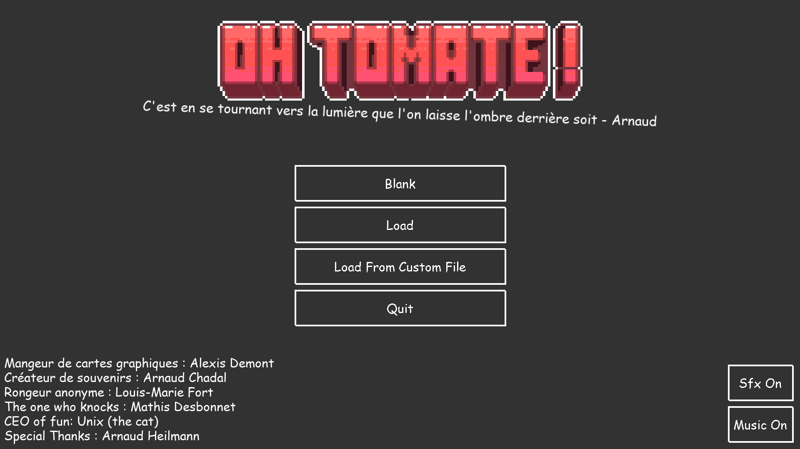
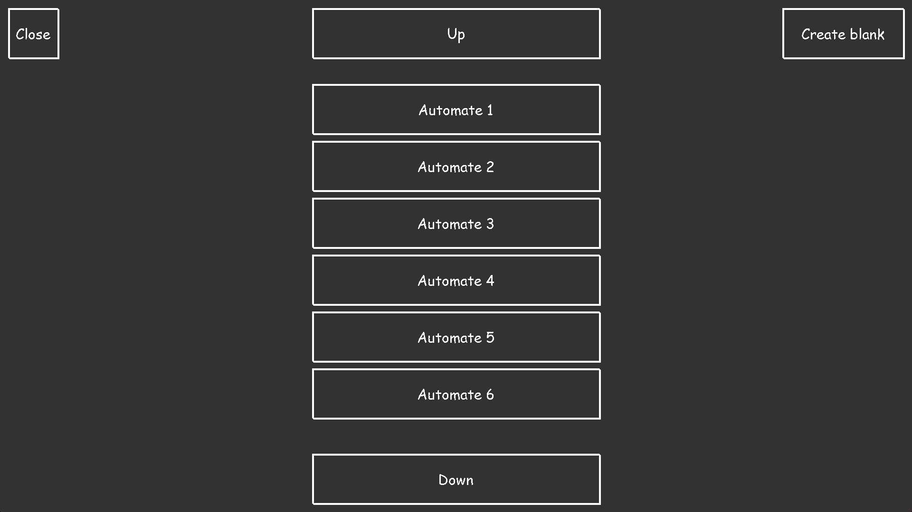
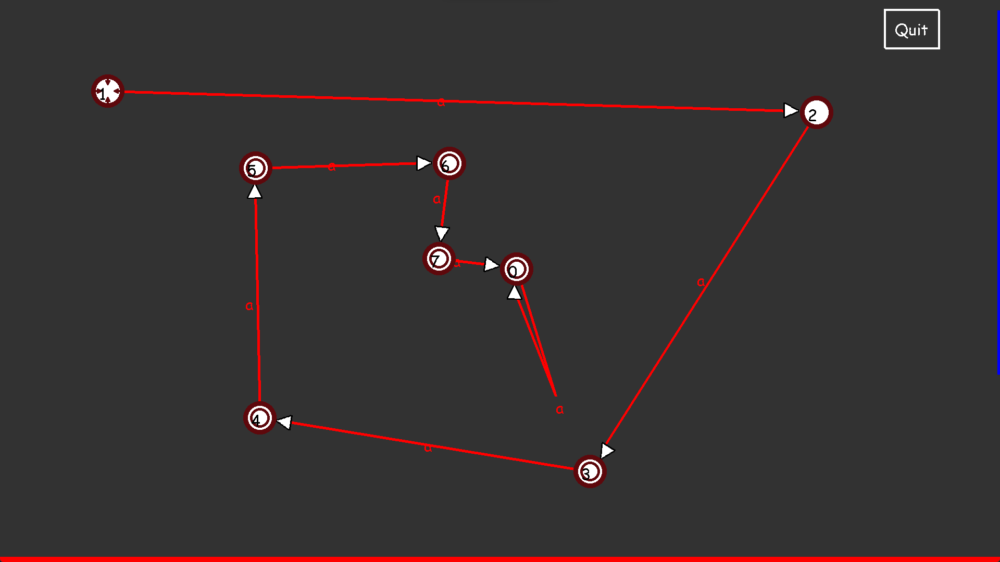
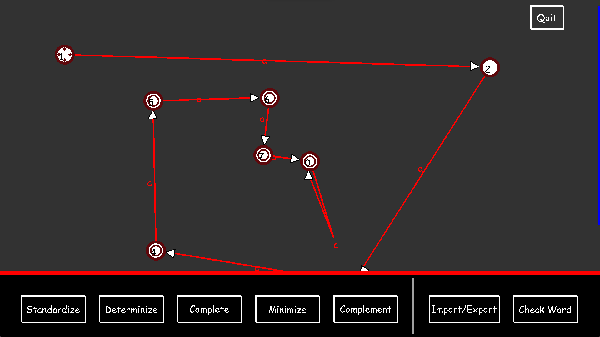
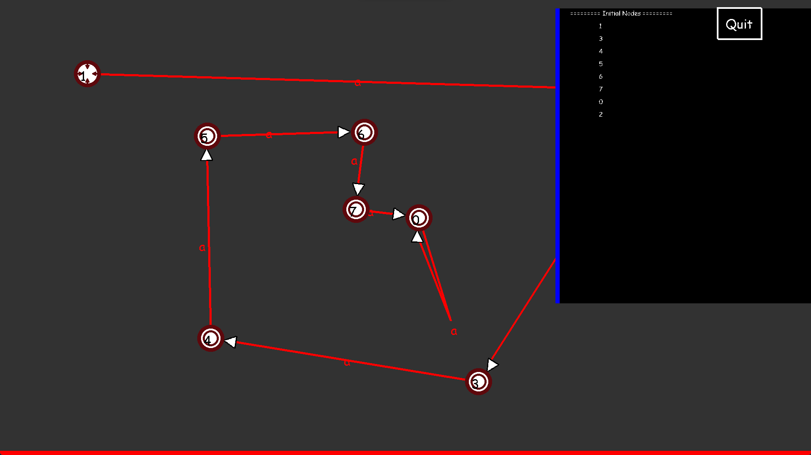

# OH ! Tomate

    

## About OH ! Tomate

**OH ! Tomate** is a project as part of the Automate module in second year of preparatory class in Efrei. The point of this app is to create, modify and apply algorithms to what is called an automate. The first version of this app was buit using python and the pygame library within a week. We are currently working on a more stable version before building a better one directly for the web.

## Getting Started with OH ! Tomate

If you're new, you can directly download the latest version and just have fun! For more information on how to install the package, see : [Installation Instruction](https://github.com/Arnaud-Chadal/oh-tomate/wiki/Installation-and-usage).

However, we recommend you to learn a little bit about automate before diving into this incredible app. You can learn basic and more advanced knowledge directly in our wiki : [Learn about automate](https://github.com/Arnaud-Chadal/oh-tomate/wiki/Learn-about-automate).
## Organization of the project

In our app, you can find the .py files and other folders.

Firstly, you can find a lot of .py files. You have 2 category of python files : Object and UI.

### Object and Class

Automate.py, node.py, button.py, graphicLink.py, graphicNode.py are all files that represent Object.

| Name of the File                                | Description                                                                         |
| ------------------------------------ | ----------------------------------------------------------------------------------- |
| Node.py                      | This class represents a node/a state. Each node has a name (which is an int) and a list of links to other nodes.                                            |
| Automate.py | This class is one of the most important classes. It's basically a collection of all current nodes. In this class, you will find functions that will modify the automate (Determinize, Minimize...) and others to check its state |
| GraphicLink.py & GraphicNode.py | Those files are ONLY used to represent a state and a link **graphicaly**. We don't use them in algorithm and in automate.py. |
| Button.py | Button.py is different than the other one because it exists just to make our graphic code smaller and more readable |

### UI

GraphicWindow.py and menu.py are files used to display something onto the user's screen.

| Name of the File                                | Description                                                                         |
| ------------------------------------ | ----------------------------------------------------------------------------------- |
| GraphicWindow.py                      | This file is our biggest one. It is used every time you're playing with an automate because it's the one that wil display the node, the link, but also manage the user input etc... |
| Main.py | Main.py is the main menu of our app. You run this one to run the entire app. |

### Folders

Lastly, you can find some folders like:
- automates : this folder contains preset of automate that you can open using the LOAD button
- images : this folder contains all images used to represent a node graphicaly
- src : this folder contains the sounds used by the app

## Screenshots

| Image                                | Description                                                                                      |
| ------------------------------------ | :------------------------------------------------------------------------------------------------: |
| Main Menu                            |                                                        |
| Edition Window                       |                        |
| Import Export Window                 |                  |
| Edition Window with an automate open |  |
| Action Menu Open                     |                      |
| Transition Menu Open                 |                  |
